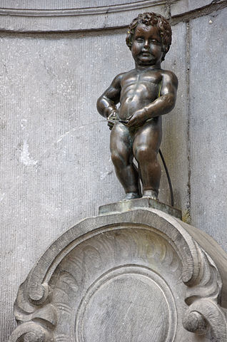

Goal
====

Burn an open RISC-V chip from an FPGA design.

It is now possible to make your own chip from an open FPGA design via Chips4makers.io.

Let's make one!

Why?
====

Because Belgians have the best chips.

And because freedom matters.

Specifications
==============

* RISC-V CPU core
* USB
* UART
* HDMI
* RAM
* add your wish list here

Links
=====

* https://fr.wikipedia.org/wiki/Manneken-Pis
* https://commons.wikimedia.org/wiki/File:Bruxelles_Manneken_Pis.jpg (CC BY-SA 3.0)
* https://chips4makers.io/
* https://hackaday.io/project/27091-chips4makers-pilot-retro-uc
* https://github.com/Fatsie
* https://twitter.com/fpga_dave/status/1053290842809683968
